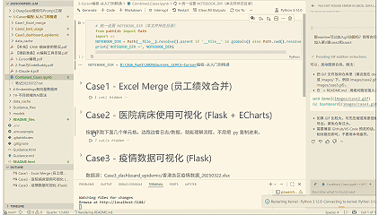
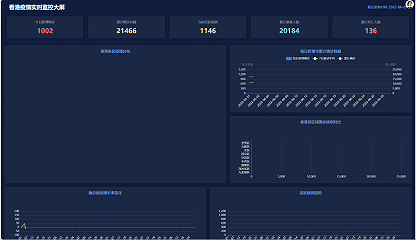

# 2025Courses_LLM Portfolio

A collection of independent projects spanning LLM applications, data analysis, visualization, and agent/tooling demos. Curated for PhD applications and data/AI roles, emphasizing end-to-end problem solving, reproducibility, and interpretable results.

## Highlights
- **LLM & Agent Practice:** Prompt engineering, function calling, retrieval/embedding workflows, and local model serving (DeepSeek, Ollama, Qwen). Includes web search, function-enabled chat, and streaming clients.
- **Data Science & ML:** Feature engineering, model training (CatBoost, XGBoost), and submission-ready pipelines for tabular problems (used-car price prediction, ensemble stacking).
- **Full-Stack Visual Analytics:** Flask + ECharts dashboards (hospital bed usage, epidemic trends) with caching, API design, and front-end interactivity; Excel data prep notebooks for fast inspection.
- **Reproducible Notebooks:** Stepwise notebooks for each case, with minimal dependencies and runnable scripts for automation.

## Project Map
- **1-AI大模型原理与API使用**
  - Function calling demos, sentiment analysis, weather tool, table extraction, ops incident handling, web search (Qwen/DeepSeek). Notebooks + Python scripts show prompt design and tool invocation patterns.
- **2-DeepSeek使用与Prompt工程**
  - Prompt engineering exercises, DeepSeek model usage, local/remote model calls, Ollama streaming & FastAPI clients. Emphasis on instruction tuning style prompts and latency-aware streaming.
- **3-Cursor编程-从入门到精通**
  - **Case1 Excel Merge:** Excel-based data joins and cleaning for HR performance data.
  - **Case2 Bed Usage Dashboard:** Flask + ECharts; precompute cache, exploratory charts, and server routes for hospital bed utilization.
    
  - **Case3 Epidemic Dashboard:** Time series + geo visualizations with risk stratification; API layer, geojson name mapping, and tooltip enrichment. Front-end and back-end both included.
    
  - Shared combined notebook for running cases sequentially, with unified path handling.
- **4-Embeddings和向量数据库**
  - FAISS-based ChatPDF, embedding computation with metadata, and basic retrieval demos; includes hotel recommendation and word2vec practice.
- **19-不同领域的AI算法**
  - Used-car price prediction end-to-end: EDA, feature engineering, CatBoost/XGBoost training, ensembling, and submission artifacts.

## What This Shows (PhD / Industry fit)
- **Research mindset:** Clear baselines, ablations (feature importance, rolling metrics), and transparent data processing.
- **Systems thinking:** From data ingestion → model/metric computation → API → front-end visualization; caching, anti-cache headers, and name-mapping to avoid data drift.
- **Practical AI:** Tool use, retrieval, and local model serving patterns that map to agentic workflows.
- **Reproducibility:** Requirements files per case, scripts mirroring notebooks, and small, runnable examples.

## How to Run (quick start)
1) Create/activate a Python env (3.10+ recommended).
2) Install per-case requirements (e.g., `pip install -r 3-Cursor编程-从入门到精通/Case3_dashboard_epidemic/requirements.txt`).
3) For dashboards: run the Flask app (`python app.py --port 5000`) inside each case folder; open http://127.0.0.1:5000/.
4) For notebooks: open in VS Code/ Jupyter; follow the stepwise cells (path setup cells provided).

## Suggested Reading Order
- Quick scan: This README → case-specific READMEs (Case2/Case3) → requirements files.
- LLM/Agent: 1-AI大模型原理与API使用 and 2-DeepSeek使用与Prompt工程.
- Data/ML: 19-不同领域的AI算法 (used-car project) + embeddings/FAISS folder.
- Full-stack demo: 3-Cursor编程-从入门到精通 (Case2/Case3 dashboards).

## Next Steps (if extending)
- Add automated tests for API schema/length checks on dashboards.
- Plug retrieval/LLM summarization into dashboards for narrative insights.
- Package notebooks into scripts/CLIs for batch runs.
